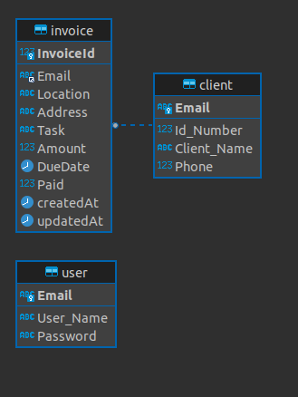

# Payment Reminder Application

Documentation: https://documenter.getpostman.com/view/18146738/2s935pqP8M

## Author: 
Catherine Muthoni

## Description
This is a Expressjs application that enables freelancers to track their payments by sending invoices and payment reminders to their clients

## Features
- <strong>User Signup</strong> : The application user creates an account that they will use to operate the app.
- <strong>User Login</strong> : The application user logs in to the account and goes through authentication so as to be authorized to use the different app features.
- <strong>Adding Client Data</strong> : The application user can add the data of their client.
- <strong>Invoice Creation</strong> : The application user can create an invoice for a clientg that they have already added to the application.
- <strong>Invoice Sending</strong> : The user can send invoices to the client's email. This feature will also automatically send a reminder to the client if they have exceeded the invoice due date.
- <strong>Payment</strong> : The client can make a payment through the link provided in the invoice sent via email.

## Main Learnings
- JWT Authentication
- 3rd Party APIs - Payment API implementation
- Emailing using nodemailer and SendGrid API
- Event scheduling using nodecron

## Entity Relationship Diagram(ERD)

